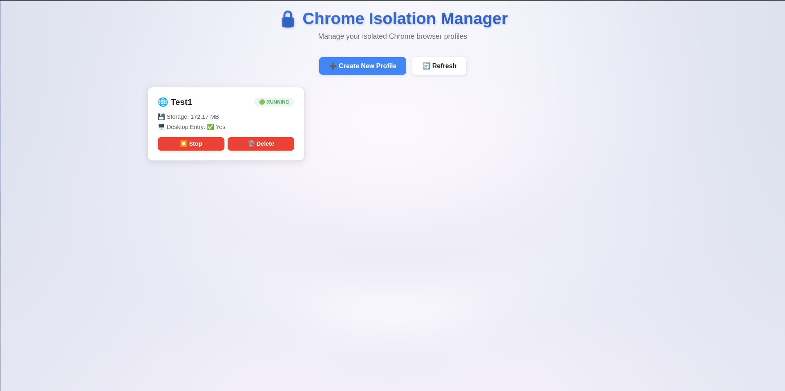
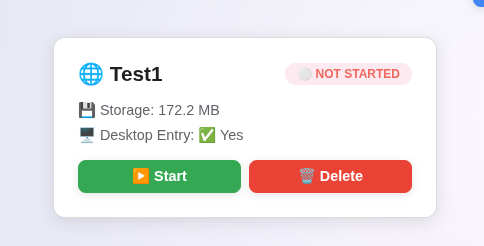

# 🔒 Chrome Isolation Manager

<div align="center">


**A complete web-based solution for managing isolated Google Chrome browser profiles on Linux**

[Features](#-features) • [Installation](#-installation) • [Usage](#-usage) • [Screenshots](#-screenshots) • [Documentation](#-documentation)

</div>

---

## 🌟 Overview

Chrome Isolation Manager is a powerful, production-ready web application that allows you to run multiple isolated Chrome browser instances on Linux. Each profile runs in its own Docker container with complete filesystem isolation, while maintaining seamless desktop integration.

Perfect for:
- 🏢 **Work/Personal Separation** - Keep work and personal browsing completely isolated
- 🔐 **Privacy & Security** - Contain potentially risky browsing activities
- 👥 **Multi-Account Management** - Different profiles for different accounts
- 🧪 **Testing & Development** - Clean environments for web development
- 🛡️ **Enhanced Security** - Sandboxed browsing with no cross-contamination

## ✨ Features

### 🌐 Modern Web Dashboard
- Intuitive, responsive interface for managing all your profiles
- Real-time status updates (auto-refresh every 5s)
- Light minimalistic theme with smooth animations
- Toast notifications instead of intrusive alerts
- Profile cards with status indicators and storage usage

### 🔐 Complete Isolation
- Each profile runs in a separate Docker container
- Filesystem isolation (only profile directory mounted)
- No access to host system files
- Containers run as non-root user (UID 1000)
- Chrome sandbox enabled with proper capabilities

### 🖥️ Desktop Integration
- Profiles appear as native apps in your application menu
- Desktop entries: "Chrome (ProfileName)"
- Click any profile icon to automatically start its container
- Seamless window integration with your desktop environment

### 💾 Persistent Storage
- Profile data stored in `~/Chrome/[ProfileName]` by default
- Custom profile locations supported
- Downloads folder automatically created
- Profile size monitoring in the dashboard

### 🎨 Premium UI/UX
- Light, minimalistic design with custom background support
- Smooth animations and transitions
- Ripple effects on button clicks
- Card hover animations with top border reveal
- Modal slide-in effects
- Auto-dismissing toast notifications

### ⚙️ One-Command Installation
- Automated setup with dependency checking
- Systemd service integration (auto-starts on boot)
- Builds optimized Docker image with BuildKit
- Opens web interface automatically after installation

### 🔊 Full Feature Support
- ✅ Audio support (PulseAudio/PipeWire)
- ✅ Two-way clipboard sync
- ✅ GPU acceleration (AMD/Intel/NVIDIA)
- ✅ Webcam support
- ✅ Custom Chrome flags
- ✅ **Export/Import Profiles** - Backup and restore profiles easily (ZIP format)
- ✅ **Automatic Display Setup** - Auto-configures X11/Wayland access

## 📋 Requirements

- **OS**: Ubuntu 20.04+ (or Debian-based Linux)
- **Docker**: Docker Engine (not Docker Desktop)
- **Python**: 3.8+
- **RAM**: 4GB minimum
- **Storage**: 32GB free space
- **Virtualization**: KVM enabled in BIOS

## 🚀 Installation

### Quick Install

```bash
# Clone the repository
git clone https://github.com/MuhammadUsamaMX/chrome-isolation-linux.git
cd chrome-isolation-linux

# Run the installer
./install.sh
```

The installer will:
1. ✅ Check system requirements
2. 📦 Install Python dependencies (Flask, docker-py)
3. 📁 Copy files to `~/.local/share/chrome-isolation-manager`
4. 🐳 Build the Docker image
5. 🔧 Set up systemd service
6. 🌐 Start the web interface
7. 🎉 Open `http://localhost:5000` automatically

**Installation Location**: `~/.local/share/chrome-isolation-manager`

After installation, you can safely delete the cloned repository - the application runs from the installation directory.

### Uninstallation

```bash
# From the cloned repository directory
./uninstall.sh
```

This will remove:
- Application files from `~/.local/share/chrome-isolation-manager`
- Systemd service
- Docker containers and image
- Desktop entries

**Note**: Your profile data in `~/Chrome` will be preserved. To remove it:
```bash
rm -rf ~/Chrome
```

### Manual Installation

If you prefer manual installation:

```bash
# Install dependencies
sudo apt update
sudo apt install -y python3-flask python3-docker docker.io

# Add user to docker group
sudo usermod -aG docker $USER
newgrp docker

# Build Docker image
DOCKER_BUILDKIT=1 docker build -t isolated-chrome .

# Install systemd service
sudo cp systemd/chrome-manager.service /etc/systemd/system/
sudo systemctl daemon-reload
sudo systemctl enable chrome-manager.service
sudo systemctl start chrome-manager.service
```

## 📖 Usage

### Web Interface

1. **Open the Dashboard**
   ```
   http://localhost:5000
   ```

2. **Create a Profile**
   - Click "➕ Create New Profile"
   - Enter a name (e.g., "Work", "Personal", "Shopping")
   - Optionally specify a custom location
   - Click "Create"

3. **Manage Profiles**
   - **Start**: Click "▶️ Start" to launch the browser
   - **Stop**: Click "⏹️ Stop" to stop the container
   - **Delete**: Click "🗑️ Delete" to remove the profile

### Desktop Integration

After creating a profile, find it in your application menu:

```
Applications → Internet → Chrome (ProfileName)
```

Click to launch - the container auto-starts if not running!

### 🖥️ Display Setup (X11/Wayland)

The application automatically handles display access for Docker containers. However, if you encounter display issues, you can add the startup script to your session:

1.  **Open Startup Applications**
2.  **Add a new entry**:
    -   **Name**: Chrome Isolation X11 Setup
    -   **Command**: `~/.local/share/chrome-isolation-manager/scripts/startup.sh`
    -   **Comment**: Configures X11 access for Docker

This ensures X11 access is always configured when you log in.

### Command Line

```bash
# View service status
sudo systemctl status chrome-manager.service

# View logs
sudo journalctl -u chrome-manager.service -f

# Restart service
sudo systemctl restart chrome-manager.service

# Stop service
sudo systemctl stop chrome-manager.service

# List all Chrome containers
docker ps -a --filter "name=chrome-"

# Stop a specific profile
docker stop chrome-ProfileName
```

## 📸 Screenshots

### Dashboard

*Light, minimalistic dashboard with profile cards*

### Create Profile

*Modal dialog for creating new profiles with custom location support*

### Profile Card

*Profile card showing status, storage, and action buttons*

## 🏗️ Architecture

```
chrome-isolation/
├── app/
│   ├── app.py                 # Flask web application
│   ├── config.py              # Configuration
│   ├── docker_manager.py      # Container lifecycle
│   ├── desktop_manager.py     # Desktop entry management
│   ├── static/
│   │   ├── css/style.css      # UI styling
│   │   ├── js/app.js          # Frontend logic
│   │   └── images/            # Background images
│   └── templates/
│       └── index.html         # Dashboard
├── scripts/
│   └── chrome-launcher.sh     # Desktop entry launcher
├── docs/
│   └── screenshots/           # Screenshot directory
│       └──create-modal.png   # Create profile modal screenshot
│       └──dashboard.png      # Dashboard screenshot
│       └──profile-card.png   # Profile card screenshot
├── systemd/
│   └── chrome-manager.service # System service
├── Dockerfile                 # Chrome container image
├── install.sh                 # Automated installer
├── uninstall.sh                 # Automated uninstaller
└── README.md                  # This file
```

### Technology Stack

- **Backend**: Python 3 + Flask
- **Frontend**: Vanilla JavaScript (no frameworks)
- **Containerization**: Docker + Docker SDK for Python
- **Service Management**: systemd
- **Desktop Integration**: .desktop files + XDG standards

## 🔧 Configuration

### Profile Storage
- **Default Location**: `~/Chrome/[ProfileName]`
- **Custom Location**: Specify during profile creation
- **Downloads**: `~/Chrome/[ProfileName]/Downloads`

### Web Interface
- **Host**: `127.0.0.1` (localhost only)
- **Port**: `5000`
- **Auto-refresh**: Every 5 seconds

### Desktop Entries
- **Location**: `~/.local/share/applications/`
- **Format**: `chrome-[ProfileName].desktop`

## 🔐 Security Features

- ✅ Containers run as non-root user
- ✅ Filesystem isolation (only profile directory mounted)
- ✅ Web interface bound to localhost only
- ✅ Sandboxed Chrome with proper capabilities
- ✅ Audio/GPU passthrough without host access
- ✅ No cross-profile data contamination

## 🐛 Troubleshooting

### Service won't start
```bash
# Check service status
sudo systemctl status chrome-manager.service

# View detailed logs
sudo journalctl -u chrome-manager.service -n 50
```

### Container won't start
```bash
# Ensure Docker is running
sudo systemctl status docker

# Check if user is in docker group
groups

# Verify image exists
docker images | grep isolated-chrome
```

### Audio not working
```bash
# Check PulseAudio/PipeWire is running
pactl info

# Verify socket exists
ls -l /run/user/$(id -u)/pulse/native
```

### Desktop entry not appearing
```bash
# Update desktop database
update-desktop-database ~/.local/share/applications

# Log out and log back in
```

## 📝 API Documentation

### Endpoints

| Method | Endpoint | Description |
|--------|----------|-------------|
| GET | `/api/profiles` | List all profiles |
| POST | `/api/profiles` | Create new profile |
| DELETE | `/api/profiles/<name>` | Delete profile |
| POST | `/api/profiles/<name>/start` | Start container |
| POST | `/api/profiles/<name>/stop` | Stop container |
| GET | `/api/profiles/<name>/status` | Get status |

### Example: Create Profile

```bash
curl -X POST http://localhost:5000/api/profiles \
  -H "Content-Type: application/json" \
  -d '{"name": "Work", "location": "/custom/path"}'
```

### Example: Start Profile

```bash
curl -X POST http://localhost:5000/api/profiles/Work/start
```

## 🤝 Contributing

Contributions are welcome! Please feel free to submit issues or pull requests.

1. Fork the repository
2. Create your feature branch (`git checkout -b feature/AmazingFeature`)
3. Commit your changes (`git commit -m 'Add some AmazingFeature'`)
4. Push to the branch (`git push origin feature/AmazingFeature`)
5. Open a Pull Request

## 📄 License

This project is licensed under the MIT License - see the [LICENSE](LICENSE) file for details.

## 🙏 Acknowledgments

Built with:
- [Flask](https://flask.palletsprojects.com/) - Web framework
- [Docker](https://www.docker.com/) - Containerization
- [Chrome](https://www.google.com/chrome/) - Browser engine
- Love ❤️ - The secret ingredient

## 📞 Support

- 🐛 **Issues**: [GitHub Issues](https://github.com/MuhammadUsamaMX/chrome-isolation-linux/issues)
- 💬 **Discussions**: [GitHub Discussions](https://github.com/MuhammadUsamaMX/chrome-isolation-linux/discussions)
- 📧 **Email**: Create an issue for support

## 🌟 Star History

If you find this project useful, please consider giving it a star ⭐

---

<div align="center">

**Made with ❤️ for privacy-conscious Linux users**

[⬆ Back to Top](#-chrome-isolation-manager)

</div>
